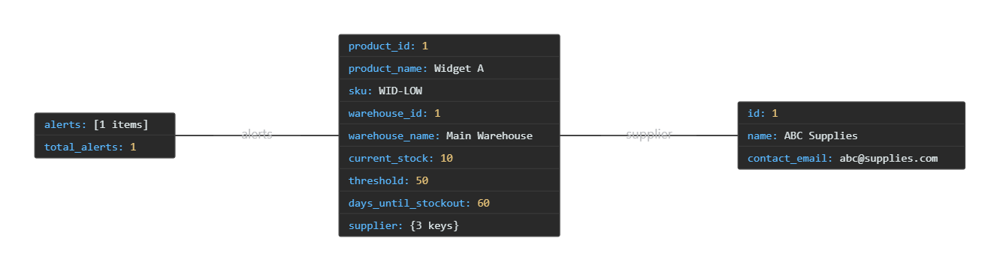
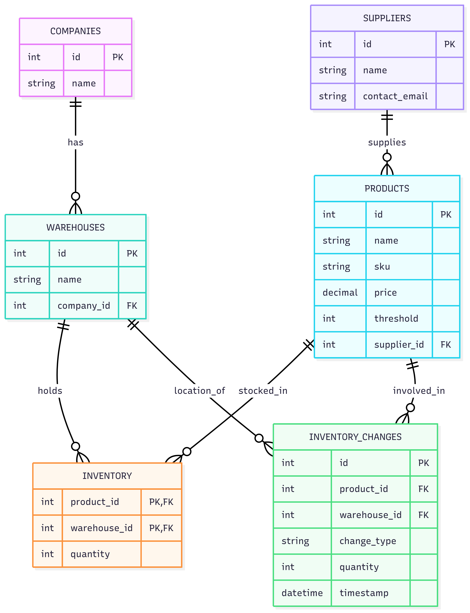

# 📦 StockFlow Backend — Inventory Alert System

This is a take-home case study for a Backend Engineering Internship. It demonstrates a simple inventory tracking API for a B2B SaaS company (StockFlow), including:

- Product management
- Inventory tracking
- Low-stock alert system with real-time insights

---

## 🚀 Tech Stack
- Python 3.11
- Flask
- SQLAlchemy
- SQLite (default; easy to swap with PostgreSQL)

---

## 🏁 Getting Started

### 1. Clone the repo
```bash
git clone https://github.com/Harshalthedev/stockflow-backend-case-study.git
cd stockflow-backend-case-study
```

### 2. Set up a virtual environment
```bash
python -m venv venv
venv\Scripts\activate  # On Windows
```

### 3. Install dependencies
```bash
pip install -r requirements.txt
```

### 4. Initialize the database
```bash
python init_db.py
python seed_low_stock.py
```

### 5. Run the app
```bash
python run.py
```
App will be available at:
```
http://127.0.0.1:5000
```

---

## 🔧 API Endpoints

### ➕ POST `/api/products`
Create a new product and assign inventory.

```json
{
  "name": "Widget A",
  "sku": "WID-001",
  "price": 49.99,
  "warehouse_id": 1,
  "initial_quantity": 100
}
```

### 🚨 GET `/api/companies/<company_id>/alerts/low-stock`
Returns low-stock alerts for recent sales.

Example:
```json
{
  "alerts": [
    {
      "product_id": 1,
      "product_name": "Widget A",
      "sku": "WID-001",
      "current_stock": 10,
      "threshold": 50,
      "days_until_stockout": 6
    }
  ]
}
```

---

## 📸 Screenshots

### ✅ Low-Stock Alert Response


### ✅ ERD Schema


---

## 🧼 Cleanup Suggestions
- Removed circular imports
- Removed unused SQL scripts
- Modular file structure

---

## 📬 Submission
This repo is ready to submit via GitHub:
> 🔗 https://github.com/Harshalthedev/stockflow-backend-case-study

---

## 🙋‍♂️ Author
**Harshal** — aspiring backend engineer.

📫 [GitHub](https://github.com/Harshalthedev) | [LinkedIn](https://linkedin.com/in/your-profile)

---

## ✅ Status: Complete & Ready for Review ✅
